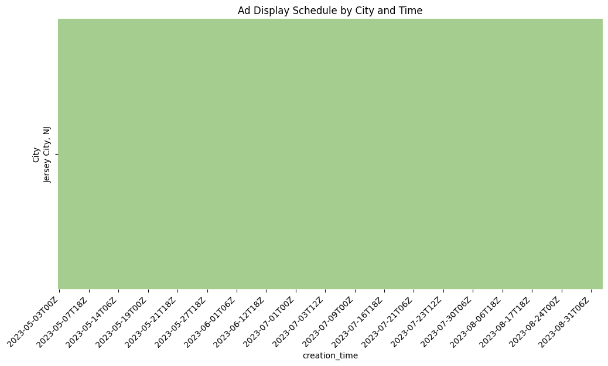

# Forecast Actions


<!-- WARNING: THIS FILE WAS AUTOGENERATED! DO NOT EDIT! -->

This file will become your README and also the index of your
documentation.

## Install

`pip install fcst_action`

- pip not yet setup

## How to use

``` python
### Get campaign details
```

``` python
company_df, campaigns_df = get_campaign_details()
```

``` python
from datetime import datetime
```

### Extract the city level campaign info

``` python
company_sel = 'TreEscape'
city_res_df, city_locations = get_campaign_hist(company_df, campaigns_df, company_sel = company_sel)
city_res_df
```

    TreEscape is in the OutdoorAdventure business operating in Jersey City, NJ
    Here is some additional background
    automated weather-based rules to activate their ‘sunny’ ad set (on Meta) and ad group (on Display) when the forecast was sunny over a 3-day window. The rolling 3-day forecast was updated several times per day based on latest weather data.

    When the forecast looked positive, WeatherAds would turn on the associated ads in Google and Meta. The ad copy also used the forecast as a hook to drive bookings for TreEscape. The tagline read “looks like sun, looks like fun!”

<div>

<div>
<style scoped>
    .dataframe tbody tr th:only-of-type {
        vertical-align: middle;
    }
&#10;    .dataframe tbody tr th {
        vertical-align: top;
    }
&#10;    .dataframe thead th {
        text-align: right;
    }
</style>

|     | creation_time       | Jersey City, NJ |
|-----|---------------------|-----------------|
| 0   | 2023-05-01 00:00:00 | None            |
| 1   | 2023-05-01 06:00:00 | None            |
| 2   | 2023-05-01 12:00:00 | None            |
| 3   | 2023-05-01 18:00:00 | None            |
| 4   | 2023-05-02 00:00:00 | None            |
| ... | ...                 | ...             |
| 480 | 2023-08-31 00:00:00 | LooklikeSunFun  |
| 481 | 2023-08-31 06:00:00 | LooklikeSunFun  |
| 482 | 2023-08-31 12:00:00 | LooklikeSunFun  |
| 483 | 2023-08-31 18:00:00 | LooklikeSunFun  |
| 484 | 2023-09-01 00:00:00 | LooklikeSunFun  |

<p>485 rows × 2 columns</p>
</div>

</div>

### Plot a heatmap by city

``` python
campaign_heatmap(city_res_df)
```



### Save a map of campaign signals

``` python
map_campaigns_by_day(city_res_df,city_locations)
```

    Map saved to ads_over_time.html

### Summary stats of \# of Ads of each type by City

#### of days campaign is run and % of time

``` python
duration_per_ad_per_city,percentage_per_ad_per_city = get_campaign_summary(city_res_df)
```

    Duration per ad per city (in seconds):
    {'Jersey City, NJ': {'LooklikeSunFun': 3607200.0}}

    Percentage of total time per ad per city:
    {'Jersey City, NJ': {'LooklikeSunFun': 33.94308943089431}}
